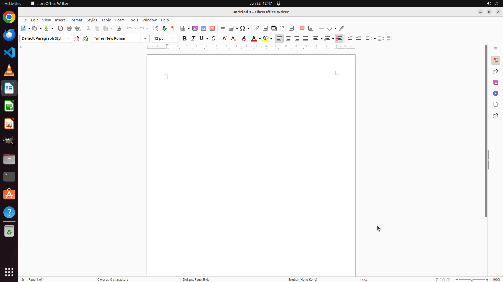

# Make Times New Roman the default Font

[← LibreOffice Writer](../README.md) · [← Showcase](../../README.md)

## Task

> Make Times New Roman the default Font

## Final state

## Artifacts

- [Trajectory](traj.jsonl) — per-step actions, reasoning, and screenshots
- [Runtime log](runtime.log)
- [Task definition](task.json) — original OSWorld task config
- Step screenshots: `step_*.png` in this folder

Task ID: `f178a4a9-d090-4b56-bc4c-4b72a61a035d` · Domain: `libreoffice_writer` · Source: `https://ask.libreoffice.org/t/how-do-i-make-times-new-roman-the-default-font-in-lo/64604`
