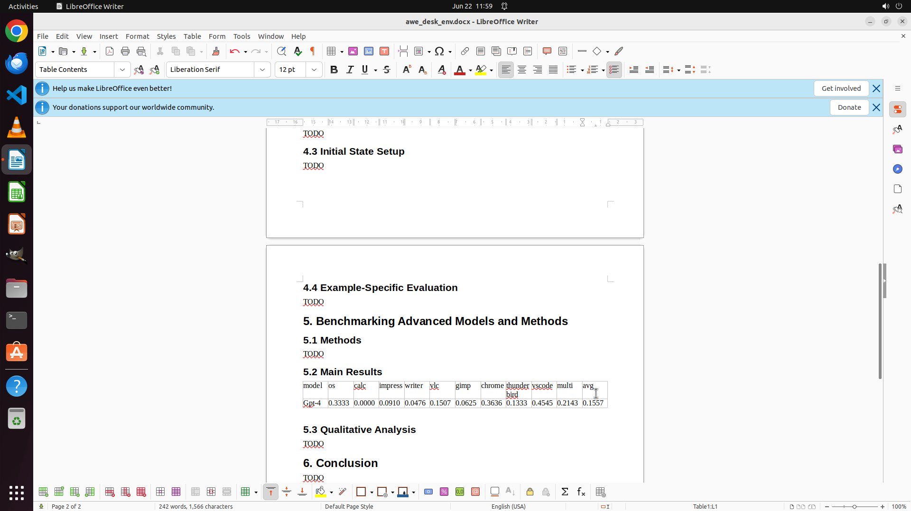

# I need to include the experiment results from "~/Documents/awesome-desktop/expe-results.xlsx" into t…

[← Multi-app Workflows](../README.md) · [← Showcase](../../README.md)

## Task

> I need to include the experiment results from "~/Documents/awesome-desktop/expe-results.xlsx" into the currently writing report. Specifically, extract the results of GPT-4 and insert a table into the "Main Results" section of my report.

## Final state

## Artifacts

- [Trajectory](traj.jsonl) — per-step actions, reasoning, and screenshots
- [Runtime log](runtime.log)
- [Task definition](task.json) — original OSWorld task config
- Step screenshots: `step_*.png` in this folder

Task ID: `00fa164e-2612-4439-992e-157d019a8436` · Domain: `multi_apps` · Source: `authors`
