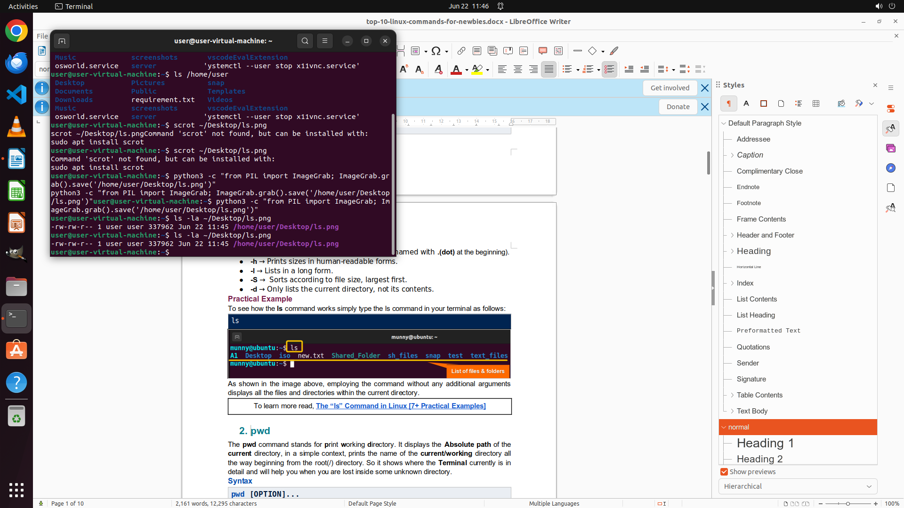

# I am currently utilizing LibreOffice Writer to compose a Linux tutorial, and I intend to display the…

[← Multi-app Workflows](../README.md) · [← Showcase](../../README.md)

## Task

> I am currently utilizing LibreOffice Writer to compose a Linux tutorial, and I intend to display the outcomes generated by executing the "ls" command in /home/user. Kindly execute this command and save the screenshot of the terminal as 'ls.png' on the Desktop.

## Final state

## Artifacts

- [Trajectory](traj.jsonl) — per-step actions, reasoning, and screenshots
- [Runtime log](runtime.log)
- [Task definition](task.json) — original OSWorld task config
- Step screenshots: `step_*.png` in this folder

Task ID: `02ce9a50-7af2-47ed-8596-af0c230501f8` · Domain: `multi_apps` · Source: `authors`
