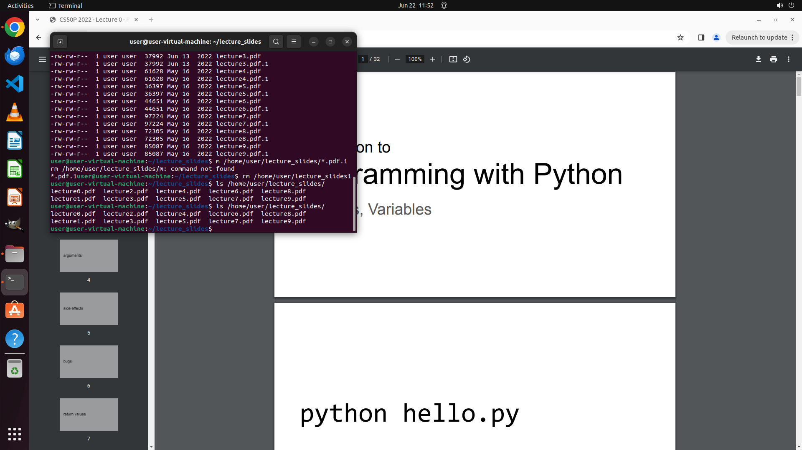

# I want to learn python programming and my friend recommends me this course website. I have grabbed t…

[← Multi-app Workflows](../README.md) · [← Showcase](../../README.md)

## Task

> I want to learn python programming and my friend recommends me this course website. I have grabbed the lecture slide for week 0. Please download the PDFs for other weeks into the opened folder and leave the file name as-it-is.

## Final state

## Artifacts

- [Trajectory](traj.jsonl) — per-step actions, reasoning, and screenshots
- [Runtime log](runtime.log)
- [Task definition](task.json) — original OSWorld task config
- Step screenshots: `step_*.png` in this folder

Task ID: `0e5303d4-8820-42f6-b18d-daf7e633de21` · Domain: `multi_apps` · Source: `authors`
