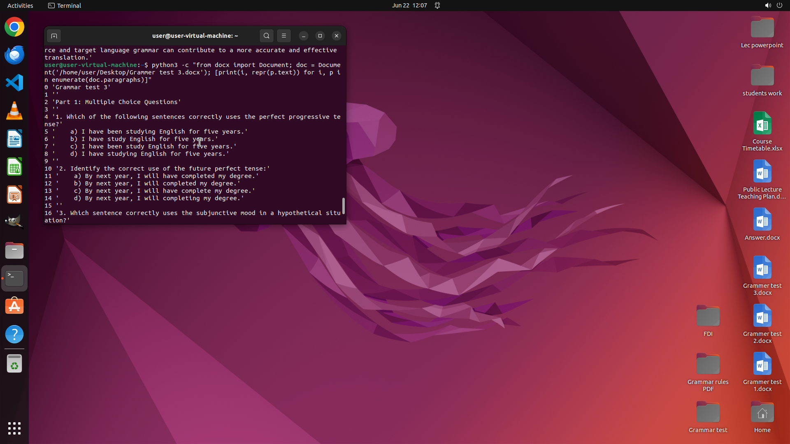

# I've prepared some grammar tests and placed them in the 'Grammar test' folder. I've already provided…

[← Multi-app Workflows](../README.md) · [← Showcase](../../README.md)

## Task

> I've prepared some grammar tests and placed them in the 'Grammar test' folder. I've already provided the multiple-choice answers for Test 1 in the 'answer doc' file. Could you please follow the same format to write out the answers for the remaining two tests in the doc file? This way, I can distribute them to the students as a reference. Thank you.

## Final state

## Artifacts

- [Trajectory](traj.jsonl) — per-step actions, reasoning, and screenshots
- [Runtime log](runtime.log)
- [Task definition](task.json) — original OSWorld task config
- Step screenshots: `step_*.png` in this folder

Task ID: `1f18aa87-af6f-41ef-9853-cdb8f32ebdea` · Domain: `multi_apps` · Source: `authors`
