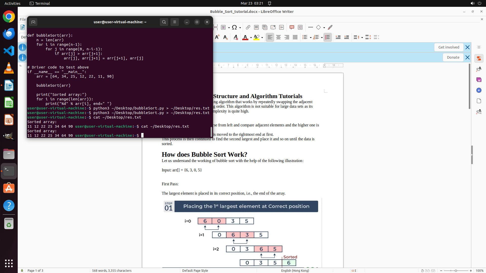

# I am currently working on my algorithm practice using the document "bubble_Sort_tutorial.docx." Plea…

[← Multi-app Workflows](../README.md) · [← Showcase](../../README.md)

## Task

> I am currently working on my algorithm practice using the document "bubble_Sort_tutorial.docx." Please assist me in completing the 'bubbleSort' function within the 'bubbleSort.py' file on the Desktop and save the output as 'res.txt' on the Desktop.

## Final state

## Artifacts

- [▶ Screen recording](recording.mp4) — full agent run
- [Trajectory](traj.jsonl) — per-step actions, reasoning, and screenshots
- [Runtime log](runtime.log)
- [Task definition](task.json) — original OSWorld task config
- Step screenshots: `step_*.png` in this folder

Task ID: `20236825-b5df-46e7-89bf-62e1d640a897` · Domain: `multi_apps` · Source: `authors`
