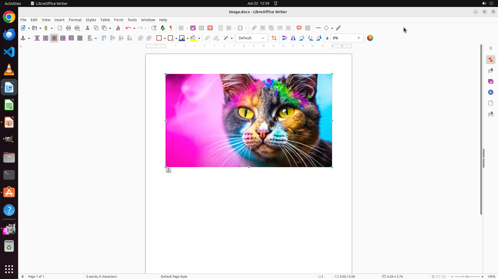

# I've stored my .xcf file on the Desktop. Can you assist me in copying the image and pasting it into …

[← Multi-app Workflows](../README.md) · [← Showcase](../../README.md)

## Task

> I've stored my .xcf file on the Desktop. Can you assist me in copying the image and pasting it into a LibreOffice Writer document? Save the document as 'image.docx' on the Desktop, please.

## Final state

## Artifacts

- [Trajectory](traj.jsonl) — per-step actions, reasoning, and screenshots
- [Runtime log](runtime.log)
- [Task definition](task.json) — original OSWorld task config
- Step screenshots: `step_*.png` in this folder

Task ID: `227d2f97-562b-4ccb-ae47-a5ec9e142fbb` · Domain: `multi_apps` · Source: `authors`
