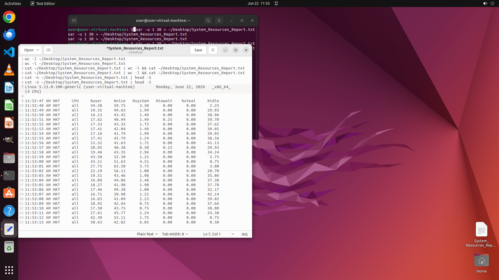

# Monitor Ubuntu system resource usage using the sar command from sysstat toolkit. Collect CPU statist…

[← Multi-app Workflows](../README.md) · [← Showcase](../../README.md)

## Task

> Monitor Ubuntu system resource usage using the sar command from sysstat toolkit. Collect CPU statistics every second for 30 seconds and save the output to 'System_Resources_Report.txt' on Desktop.

## Final state

## Artifacts

- [Trajectory](traj.jsonl) — per-step actions, reasoning, and screenshots
- [Runtime log](runtime.log)
- [Task definition](task.json) — original OSWorld task config
- Step screenshots: `step_*.png` in this folder

Task ID: `2373b66a-092d-44cb-bfd7-82e86e7a3b4d` · Domain: `multi_apps` · Source: `author`
