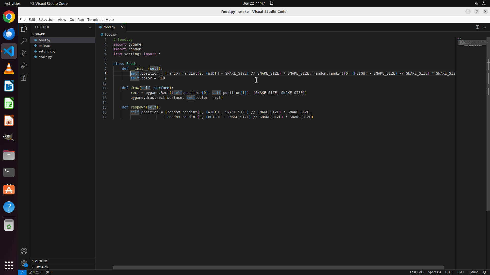

# So, I've been dabbling with coding a Snake game in Python, and I finally got it up and running. It's…

[← Multi-app Workflows](../README.md) · [← Showcase](../../README.md)

## Task

> So, I've been dabbling with coding a Snake game in Python, and I finally got it up and running. It's pretty cool, but it's not without its quirks. The biggest issue I'm facing right now is that the snake can't seem to eat the food, no matter what. Could you help me tweak the code so the snake can actually eat the food? Thanks a bunch!

## Final state

## Artifacts

- [Trajectory](traj.jsonl) — per-step actions, reasoning, and screenshots
- [Runtime log](runtime.log)
- [Task definition](task.json) — original OSWorld task config
- Step screenshots: `step_*.png` in this folder

Task ID: `26150609-0da3-4a7d-8868-0faf9c5f01bb` · Domain: `multi_apps` · Source: `authors`
