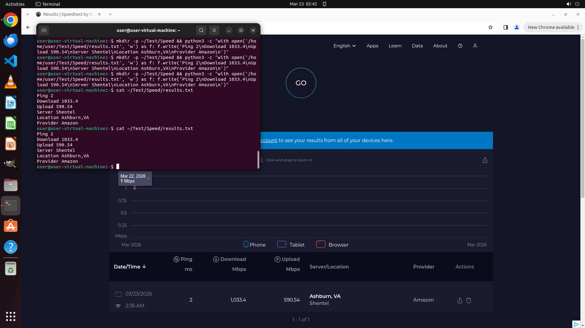

# I want to test the quality of the network environment my laptop is currently in. Please measure my n…

[← Multi-app Workflows](../README.md) · [← Showcase](../../README.md)

## Task

> I want to test the quality of the network environment my laptop is currently in. Please measure my network situation through speedtest.net, copy the results in speedtest.net/results, and save them to ~/Test/Speed/results.txt (if the dir does not exist, create it). Each metric occupies one line, with the metric name and its value separated by a single space.

## Final state

## Artifacts

- [▶ Screen recording](recording.mp4) — full agent run
- [Trajectory](traj.jsonl) — per-step actions, reasoning, and screenshots
- [Runtime log](runtime.log)
- [Task definition](task.json) — original OSWorld task config
- Step screenshots: `step_*.png` in this folder

Task ID: `26660ad1-6ebb-4f59-8cba-a8432dfe8d38` · Domain: `multi_apps` · Source: `https://www.speedtest.net/`
