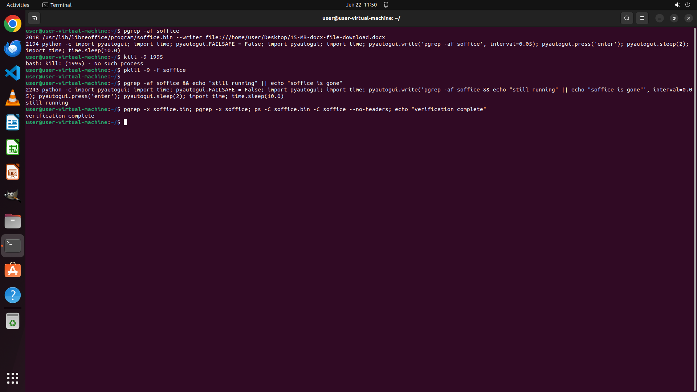

# Hey, my LibreOffice Writer seems to have frozen and I can't get it to close normally. Can you help m…

[← Multi-app Workflows](../README.md) · [← Showcase](../../README.md)

## Task

> Hey, my LibreOffice Writer seems to have frozen and I can't get it to close normally. Can you help me force quit the application from the command line? I'm on Ubuntu and I don't want to restart my computer or lose any other work I have open.

## Final state

## Artifacts

- [Trajectory](traj.jsonl) — per-step actions, reasoning, and screenshots
- [Runtime log](runtime.log)
- [Task definition](task.json) — original OSWorld task config
- Step screenshots: `step_*.png` in this folder

Task ID: `2b9493d7-49b8-493a-a71b-56cd1f4d6908` · Domain: `multi_apps` · Source: `https://devicetests.com/kill-libreoffice-writer-command-line-ubuntu`
