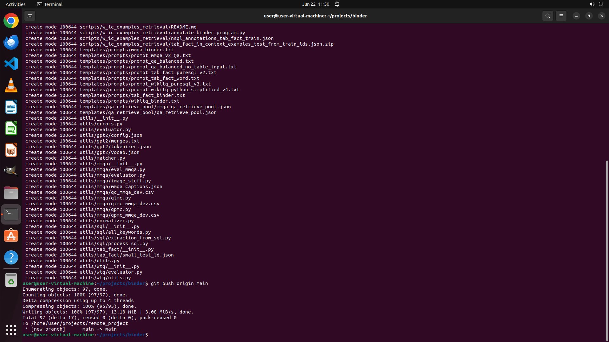

# Could you help me push the changes from commandline in current project to origin main, with the comm…

[← Multi-app Workflows](../README.md) · [← Showcase](../../README.md)

## Task

> Could you help me push the changes from commandline in current project to origin main, with the commit message "daily update"?

## Final state

## Artifacts

- [Trajectory](traj.jsonl) — per-step actions, reasoning, and screenshots
- [Runtime log](runtime.log)
- [Task definition](task.json) — original OSWorld task config
- Step screenshots: `step_*.png` in this folder

Task ID: `2c9fc0de-3ee7-45e1-a5df-c86206ad78b5` · Domain: `multi_apps` · Source: `https://nikki-ricks.medium.com/how-to-use-git-add-commit-and-push-in-vs-code-and-command-line-35c0e8c47b62`
