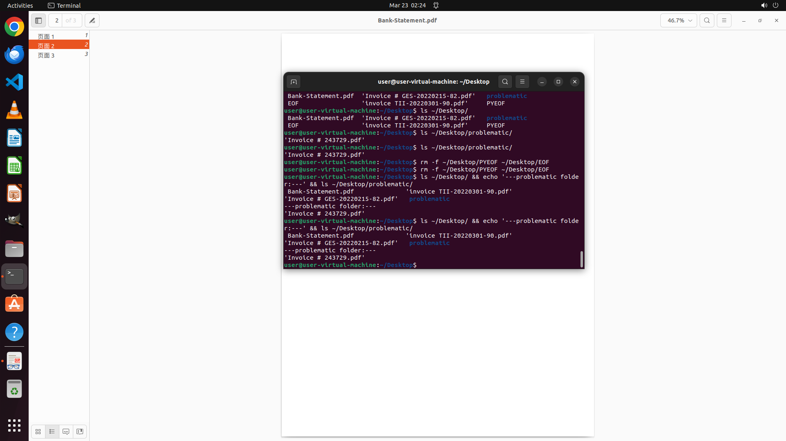

# Cross-check the invoices with the bank statements and identify any discrepancies. Then pull out the …

[← Multi-app Workflows](../README.md) · [← Showcase](../../README.md)

## Task

> Cross-check the invoices with the bank statements and identify any discrepancies. Then pull out the invoices that don't match the statements and put them in the "problematic" folder.

## Final state

## Artifacts

- [▶ Screen recording](recording.mp4) — full agent run
- [Trajectory](traj.jsonl) — per-step actions, reasoning, and screenshots
- [Runtime log](runtime.log)
- [Task definition](task.json) — original OSWorld task config
- Step screenshots: `step_*.png` in this folder

Task ID: `337d318b-aa07-4f4f-b763-89d9a2dd013f` · Domain: `multi_apps` · Source: `authors`
