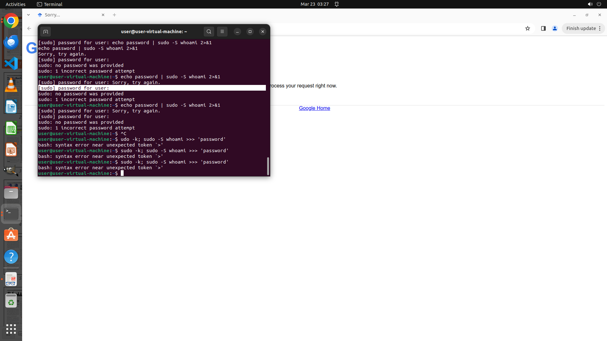

# Could you please pull up the Google Scholar page of the corresponding author for me in Chrome?

[← Multi-app Workflows](../README.md) · [← Showcase](../../README.md)

## Task

> Could you please pull up the Google Scholar page of the corresponding author for me in Chrome?

## Final state

## Artifacts

- [▶ Screen recording](recording.mp4) — full agent run
- [Trajectory](traj.jsonl) — per-step actions, reasoning, and screenshots
- [Runtime log](runtime.log)
- [Task definition](task.json) — original OSWorld task config
- Step screenshots: `step_*.png` in this folder

Task ID: `36037439-2044-4b50-b9d1-875b5a332143` · Domain: `multi_apps` · Source: `authors`
