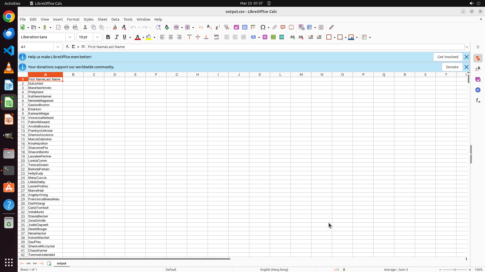

# I have file1.xlsx and file2.ods on my Desktop, each containing a single column. Using only the comma…

[← Multi-app Workflows](../README.md) · [← Showcase](../../README.md)

## Task

> I have file1.xlsx and file2.ods on my Desktop, each containing a single column. Using only the command line, help me merge these two columns into a single column by concatenating the strings from both rows, save the result as ~/Desktop/output.csv, and open it in LibreOffice Calc from the terminal

## Final state

## Artifacts

- [▶ Screen recording](recording.mp4) — full agent run
- [Trajectory](traj.jsonl) — per-step actions, reasoning, and screenshots
- [Runtime log](runtime.log)
- [Task definition](task.json) — original OSWorld task config
- Step screenshots: `step_*.png` in this folder

Task ID: `3680a5ee-6870-426a-a997-eba929a0d25c` · Domain: `multi_apps` · Source: `https://unix.stackexchange.com/questions/510850/how-to-open-calc-from-terminal-and-insert-files`
