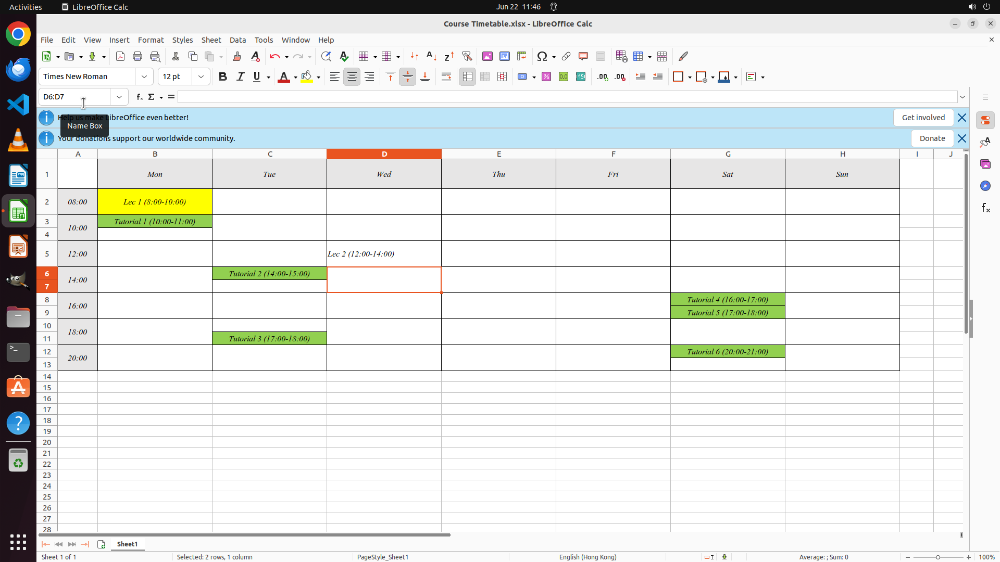

# Could you please add a two-hour lecture slot to my weekly course timetable, scheduled for every Wedn…

[← Multi-app Workflows](../README.md) · [← Showcase](../../README.md)

## Task

> Could you please add a two-hour lecture slot to my weekly course timetable, scheduled for every Wednesday at 12 PM? It seems I accidentally omitted that when setting up my schedule. I'd appreciate you taking care of that for me. Thanks!

## Final state

## Artifacts

- [Trajectory](traj.jsonl) — per-step actions, reasoning, and screenshots
- [Runtime log](runtime.log)
- [Task definition](task.json) — original OSWorld task config
- Step screenshots: `step_*.png` in this folder

Task ID: `3a93cae4-ad3e-403e-8c12-65303b271818` · Domain: `multi_apps` · Source: `authors`
