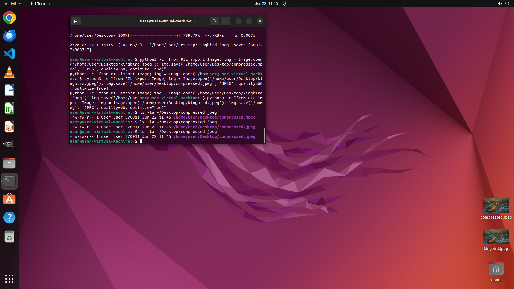

# Download the image from "https://huggingface.co/datasets/xlangai/ubuntu_osworld_file_cache/resolve/m…

[← Multi-app Workflows](../README.md) · [← Showcase](../../README.md)

## Task

> Download the image from "https://huggingface.co/datasets/xlangai/ubuntu_osworld_file_cache/resolve/main/multi_apps/3c8f201a-009d-4bbe-8b65-a6f8b35bb57f/kingbird.jpeg", and then use GIMP to compress it to under 600KB as "compressed.jpeg" on the Desktop. Resize if needed.

## Final state

## Artifacts

- [Trajectory](traj.jsonl) — per-step actions, reasoning, and screenshots
- [Runtime log](runtime.log)
- [Task definition](task.json) — original OSWorld task config
- Step screenshots: `step_*.png` in this folder

Task ID: `3c8f201a-009d-4bbe-8b65-a6f8b35bb57f` · Domain: `multi_apps`
