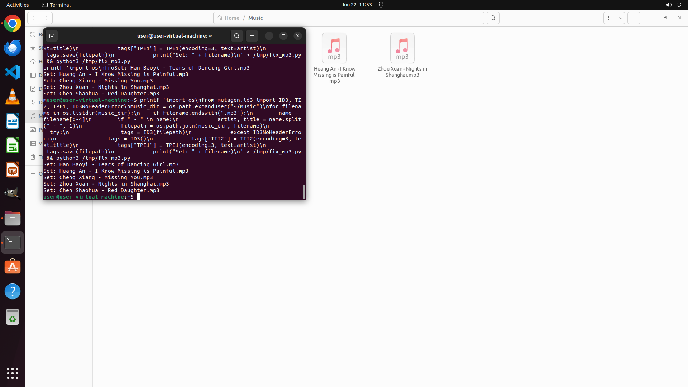

# I have a collection of MP3s with blank meta data, but already named with their artists and titles. I…

[← Multi-app Workflows](../README.md) · [← Showcase](../../README.md)

## Task

> I have a collection of MP3s with blank meta data, but already named with their artists and titles. I've heard that Picard or Kid3 may help, but I'm unfamiliar with them. Can you help me to fix the meta data "title" and "artist"?

## Final state

## Artifacts

- [Trajectory](traj.jsonl) — per-step actions, reasoning, and screenshots
- [Runtime log](runtime.log)
- [Task definition](task.json) — original OSWorld task config
- Step screenshots: `step_*.png` in this folder

Task ID: `3f05f3b9-29ba-4b6b-95aa-2204697ffc06` · Domain: `multi_apps` · Source: `authors`
