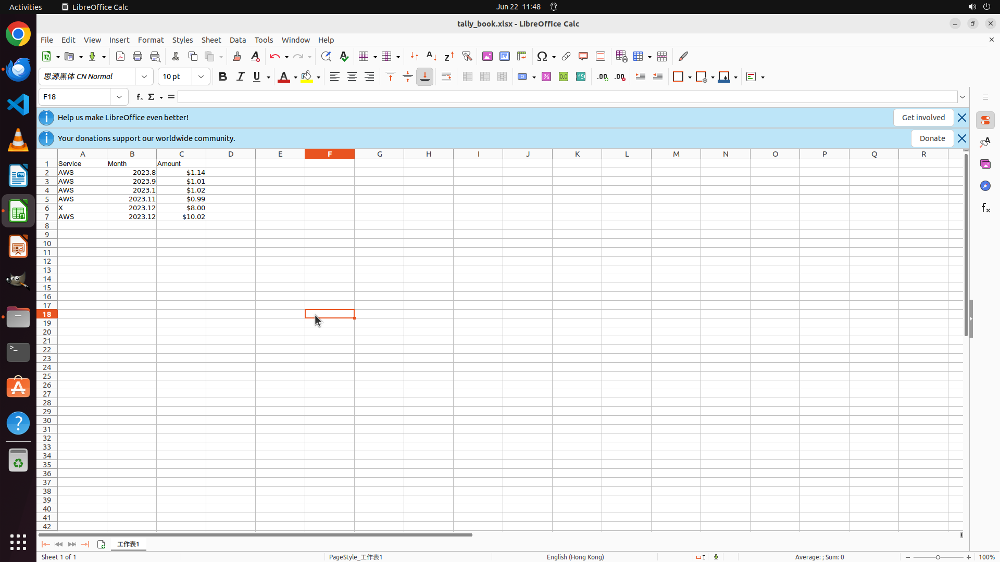

# There's an e-mail containing the AWS invoice for December saved in local "Bills" folder. Extract the…

[← Multi-app Workflows](../README.md) · [← Showcase](../../README.md)

## Task

> There's an e-mail containing the AWS invoice for December saved in local "Bills" folder. Extract the invoice PDF to the my receipts folder. Follow the file name pattern of the old files and append a record at the end of my tally book.

## Final state

## Artifacts

- [Trajectory](traj.jsonl) — per-step actions, reasoning, and screenshots
- [Runtime log](runtime.log)
- [Task definition](task.json) — original OSWorld task config
- Step screenshots: `step_*.png` in this folder

Task ID: `415ef462-bed3-493a-ac36-ca8c6d23bf1b` · Domain: `multi_apps` · Source: `authors`
