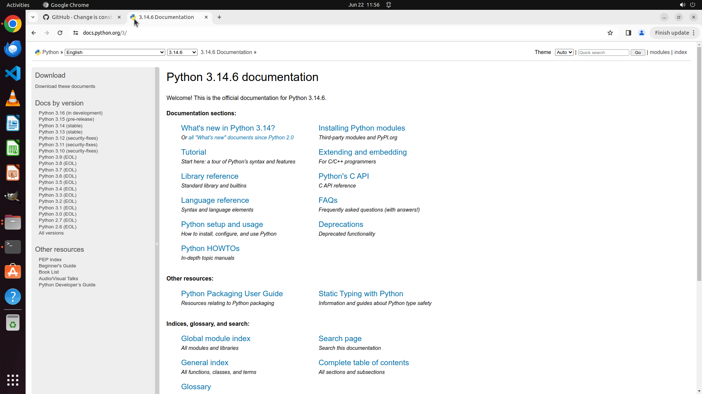

# Help me to automatically set up my work space. To be specific, open project directory of OSWorld in …

[← Multi-app Workflows](../README.md) · [← Showcase](../../README.md)

## Task

> Help me to automatically set up my work space. To be specific, open project directory of OSWorld in terminal and file manager, then open github homepage and the online document of Python in chrome browser.

## Final state

## Artifacts

- [Trajectory](traj.jsonl) — per-step actions, reasoning, and screenshots
- [Runtime log](runtime.log)
- [Task definition](task.json) — original OSWorld task config
- Step screenshots: `step_*.png` in this folder

Task ID: `48c46dc7-fe04-4505-ade7-723cba1aa6f6` · Domain: `multi_apps` · Source: `authors`
