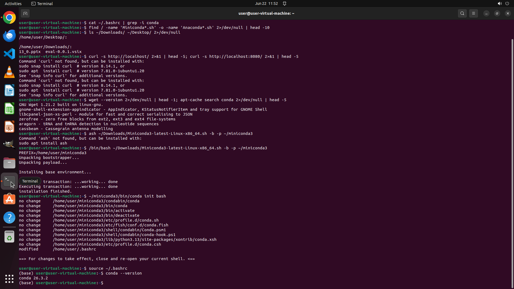

# When I ran "conda install datasets" in terminal, I got "conda: command not found". Could you help me…

[← Multi-app Workflows](../README.md) · [← Showcase](../../README.md)

## Task

> When I ran "conda install datasets" in terminal, I got "conda: command not found". Could you help me solve it so that I can use conda command right away?

## Final state

## Artifacts

- [Trajectory](traj.jsonl) — per-step actions, reasoning, and screenshots
- [Runtime log](runtime.log)
- [Task definition](task.json) — original OSWorld task config
- Step screenshots: `step_*.png` in this folder

Task ID: `48d05431-6cd5-4e76-82eb-12b60d823f7d` · Domain: `multi_apps` · Source: `authors`
