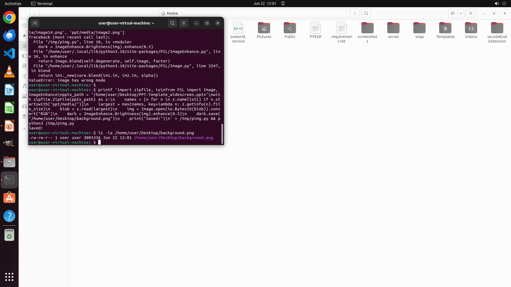

# I've noticed that the image on the second slide is too dim. Can you please enhance its brightness fo…

[← Multi-app Workflows](../README.md) · [← Showcase](../../README.md)

## Task

> I've noticed that the image on the second slide is too dim. Can you please enhance its brightness for me? Save the adjusted image on the Desktop and name it "background.png". Thank you!

## Final state

## Artifacts

- [Trajectory](traj.jsonl) — per-step actions, reasoning, and screenshots
- [Runtime log](runtime.log)
- [Task definition](task.json) — original OSWorld task config
- Step screenshots: `step_*.png` in this folder

Task ID: `4c26e3f3-3a14-4d86-b44a-d3cedebbb487` · Domain: `multi_apps` · Source: `https://www.quora.com/How-do-I-edit-a-photo-in-GIMP`
