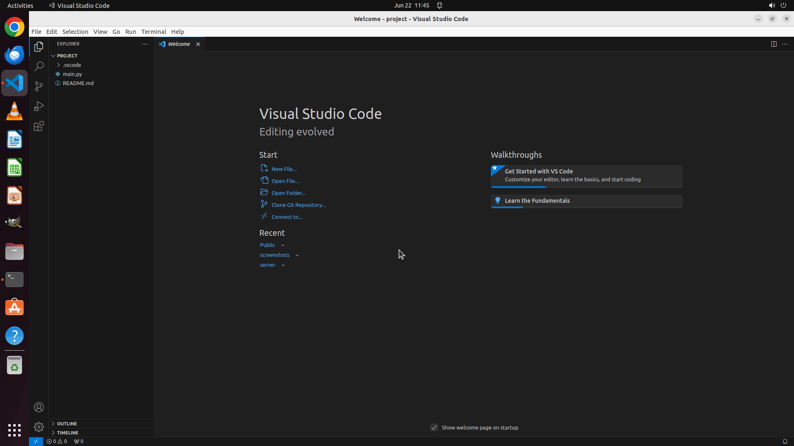

# Could you start VS Code in folder ~/Desktop/project from the terminal?

[← Multi-app Workflows](../README.md) · [← Showcase](../../README.md)

## Task

> Could you start VS Code in folder ~/Desktop/project from the terminal?

## Final state

## Artifacts

- [Trajectory](traj.jsonl) — per-step actions, reasoning, and screenshots
- [Runtime log](runtime.log)
- [Task definition](task.json) — original OSWorld task config
- Step screenshots: `step_*.png` in this folder

Task ID: `510f64c8-9bcc-4be1-8d30-638705850618` · Domain: `multi_apps` · Source: `https://www.geeksforgeeks.org/how-to-start-vs-code-from-the-terminal-command-line/`
