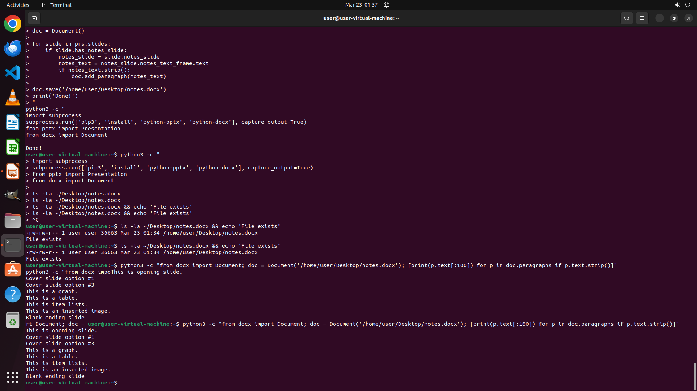

# I've been working on this presentation in LibreOffice Impress and I've added a bunch of speaker note…

[← Multi-app Workflows](../README.md) · [← Showcase](../../README.md)

## Task

> I've been working on this presentation in LibreOffice Impress and I've added a bunch of speaker notes for my upcoming talk. I'd like to have those notes handy in a separate document when I rehearse. Could you assist me in extracting all the presenter notes from the Impress file and saving them as a Word document? Just keep the text of the notes, do not add any formatting or page number information. I'd like the file to be named 'notes.docx' and placed on my Desktop for easy access.

## Final state

## Artifacts

- [▶ Screen recording](recording.mp4) — full agent run
- [Trajectory](traj.jsonl) — per-step actions, reasoning, and screenshots
- [Runtime log](runtime.log)
- [Task definition](task.json) — original OSWorld task config
- Step screenshots: `step_*.png` in this folder

Task ID: `51f5801c-18b3-4f25-b0c3-02f85507a078` · Domain: `multi_apps` · Source: `https://github.com/danielrcollins1/ImpressExtractNotes`
