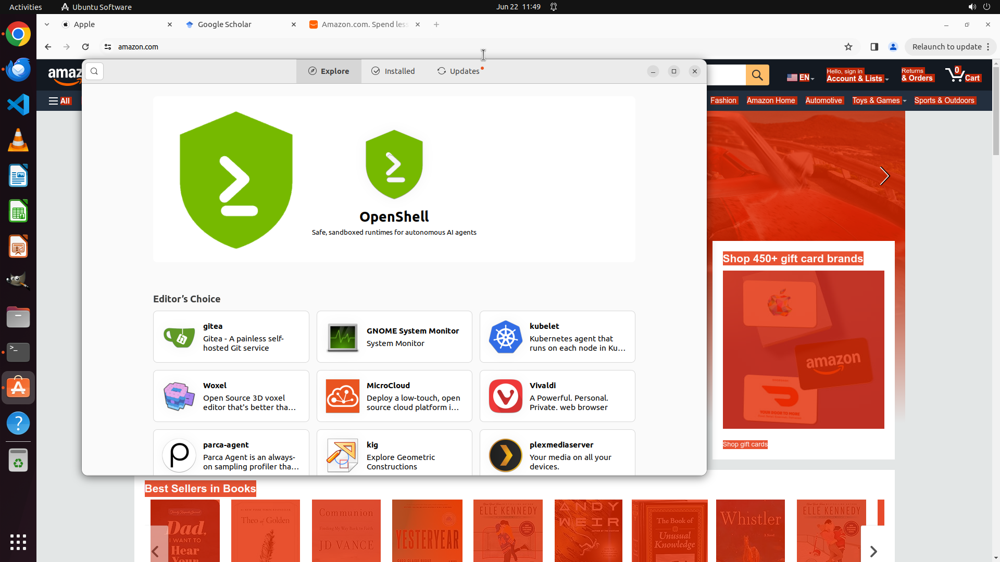

# Can you assist me by opening the first link in the latest email in Bills folder and displaying it in…

[← Multi-app Workflows](../README.md) · [← Showcase](../../README.md)

## Task

> Can you assist me by opening the first link in the latest email in Bills folder and displaying it in a new Chrome tab?

## Final state

## Artifacts

- [Trajectory](traj.jsonl) — per-step actions, reasoning, and screenshots
- [Runtime log](runtime.log)
- [Task definition](task.json) — original OSWorld task config
- Step screenshots: `step_*.png` in this folder

Task ID: `58565672-7bfe-48ab-b828-db349231de6b` · Domain: `multi_apps` · Source: `https://superuser.com/questions/1792660/open-link-from-other-application-does-not-open-the-url-in-firefox`
