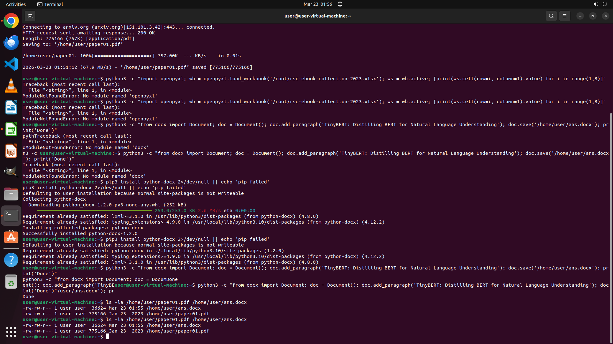

# I've compiled papers and books with links in this spreadsheet. Help me download the PDF of the first…

[← Multi-app Workflows](../README.md) · [← Showcase](../../README.md)

## Task

> I've compiled papers and books with links in this spreadsheet. Help me download the PDF of the first paper, save it as "paper01.pdf" in the /home/user directory. Additionally, I would like to know which paper in my list cites the initial one. Please determine and document the title saved as "ans.docx" in the same directory.

## Final state

## Artifacts

- [▶ Screen recording](recording.mp4) — full agent run
- [Trajectory](traj.jsonl) — per-step actions, reasoning, and screenshots
- [Runtime log](runtime.log)
- [Task definition](task.json) — original OSWorld task config
- Step screenshots: `step_*.png` in this folder

Task ID: `68a25bd4-59c7-4f4d-975e-da0c8509c848` · Domain: `multi_apps`
