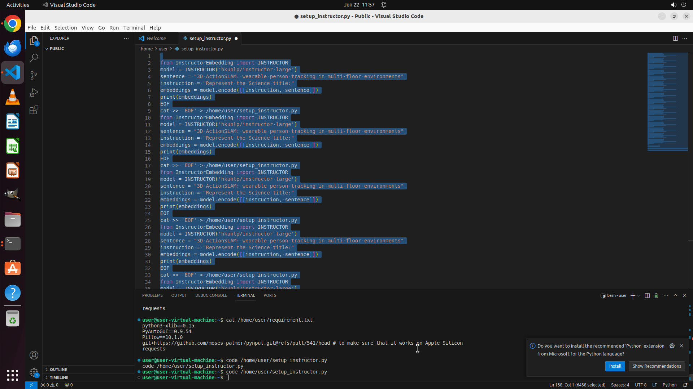

# I'm working on word embedding tasks and require assistance in configuring the environment for the pr…

[← Multi-app Workflows](../README.md) · [← Showcase](../../README.md)

## Task

> I'm working on word embedding tasks and require assistance in configuring the environment for the project located at "https://github.com/xlang-ai/instructor-embedding" in the directory /home/user. Please guide me through the process, and refer to this provided Colab script at https://colab.research.google.com/drive/1P7ivNLMosHyG7XOHmoh7CoqpXryKy3Qt?usp=sharing for reference.

## Final state

## Artifacts

- [Trajectory](traj.jsonl) — per-step actions, reasoning, and screenshots
- [Runtime log](runtime.log)
- [Task definition](task.json) — original OSWorld task config
- Step screenshots: `step_*.png` in this folder

Task ID: `69acbb55-d945-4927-a87b-8480e1a5bb7e` · Domain: `multi_apps` · Source: `authors`
