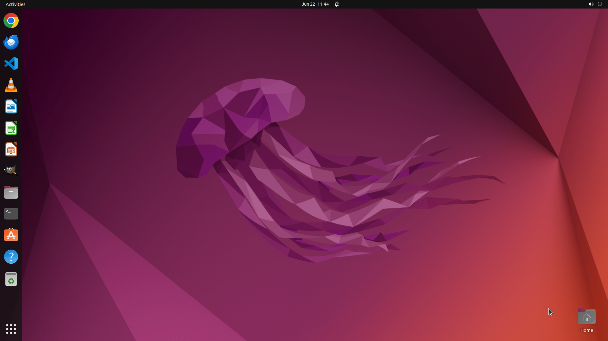

# Convert an OpenOffice/LibreOffice Impress presentation into a video using only LibreOffice Impress’s…

[← Multi-app Workflows](../README.md) · [← Showcase](../../README.md)

## Task

> Convert an OpenOffice/LibreOffice Impress presentation into a video using only LibreOffice Impress’s built-in export features (no terminal/ffmpeg, no extensions, no other apps), then play the exported video in VLC.

## Final state

## Artifacts

- [Trajectory](traj.jsonl) — per-step actions, reasoning, and screenshots
- [Runtime log](runtime.log)
- [Task definition](task.json) — original OSWorld task config
- Step screenshots: `step_*.png` in this folder

Task ID: `6d72aad6-187a-4392-a4c4-ed87269c51cf` · Domain: `multi_apps` · Source: `https://superuser.com/questions/923171/converting-openoffice-impress-presentation-to-video-without-screen-recording`
