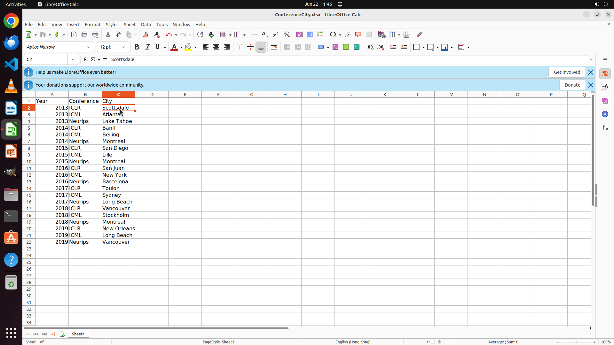

# I now want to count the meeting cities of the three machine learning conferences in the past ten yea…

[← Multi-app Workflows](../README.md) · [← Showcase](../../README.md)

## Task

> I now want to count the meeting cities of the three machine learning conferences in the past ten years from 2013 to 2019(including 2013 and 2019). I have listed the names and years of the conferences in excel. Please fill in the vacant locations.

## Final state

## Artifacts

- [Trajectory](traj.jsonl) — per-step actions, reasoning, and screenshots
- [Runtime log](runtime.log)
- [Task definition](task.json) — original OSWorld task config
- Step screenshots: `step_*.png` in this folder

Task ID: `6f4073b8-d8ea-4ade-8a18-c5d1d5d5aa9a` · Domain: `multi_apps` · Source: `author`
