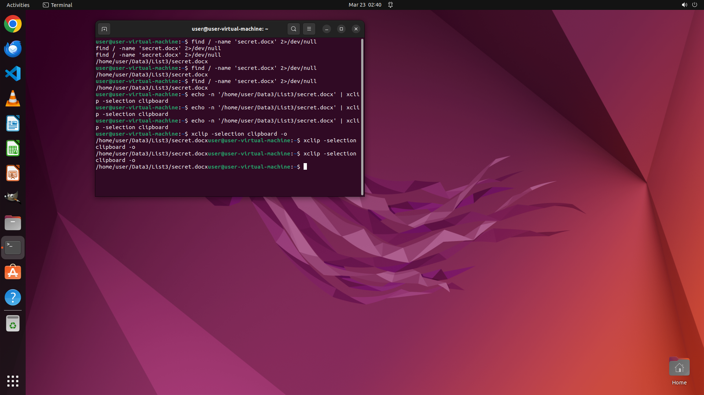

# I remember there is a file named "secret.docx" on this computer, but I can't remember where it is. P…

[← Multi-app Workflows](../README.md) · [← Showcase](../../README.md)

## Task

> I remember there is a file named "secret.docx" on this computer, but I can't remember where it is. Please find the path where this file is stored and copy it to the clipboard.

## Final state

## Artifacts

- [▶ Screen recording](recording.mp4) — full agent run
- [Trajectory](traj.jsonl) — per-step actions, reasoning, and screenshots
- [Runtime log](runtime.log)
- [Task definition](task.json) — original OSWorld task config
- Step screenshots: `step_*.png` in this folder

Task ID: `716a6079-22da-47f1-ba73-c9d58f986a38` · Domain: `multi_apps`
