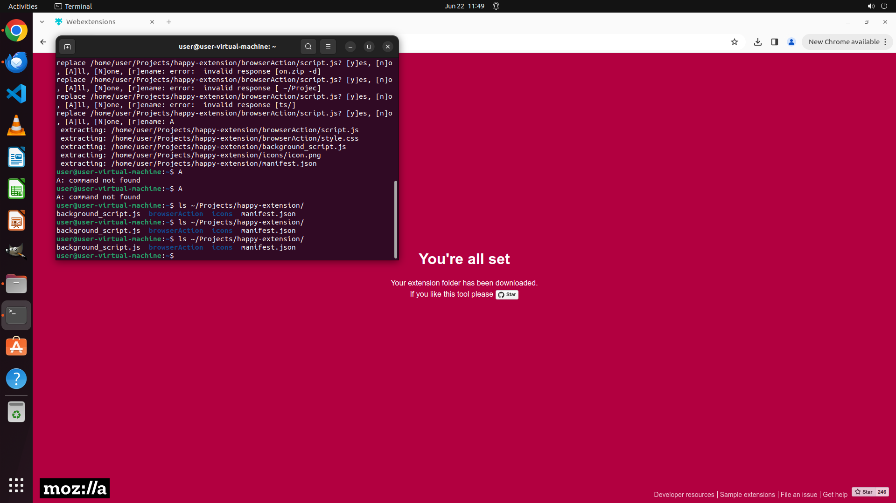

# Help me to set up an initial web extension project with help of the web tool, tagging it "happy-exte…

[← Multi-app Workflows](../README.md) · [← Showcase](../../README.md)

## Task

> Help me to set up an initial web extension project with help of the web tool, tagging it "happy-extension v0.0.1". Leave description blank for now. Include a background script and browser action, while other features are not required. Remember to unzip the auto-generated folder into "~/Projects".

## Final state

## Artifacts

- [Trajectory](traj.jsonl) — per-step actions, reasoning, and screenshots
- [Runtime log](runtime.log)
- [Task definition](task.json) — original OSWorld task config
- Step screenshots: `step_*.png` in this folder

Task ID: `74d5859f-ed66-4d3e-aa0e-93d7a592ce41` · Domain: `multi_apps` · Source: `authors`
