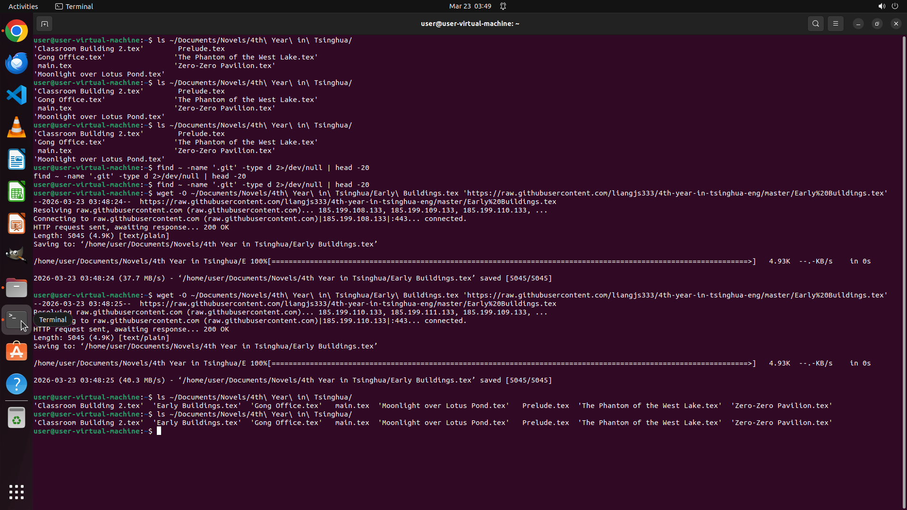

# I'm tracking updates for a short tale set on https://github.com/liangjs333/4th-year-in-tsinghua-eng.…

[← Multi-app Workflows](../README.md) · [← Showcase](../../README.md)

## Task

> I'm tracking updates for a short tale set on https://github.com/liangjs333/4th-year-in-tsinghua-eng. I have already downloaded several chapters for reading and archiving. Please assist me in downloading the next chapter I haven't obtained yet and save it to my novel collection folder.

## Final state

## Artifacts

- [▶ Screen recording](recording.mp4) — full agent run
- [Trajectory](traj.jsonl) — per-step actions, reasoning, and screenshots
- [Runtime log](runtime.log)
- [Task definition](task.json) — original OSWorld task config
- Step screenshots: `step_*.png` in this folder

Task ID: `788b3701-3ec9-4b67-b679-418bfa726c22` · Domain: `multi_apps` · Source: `authors`
