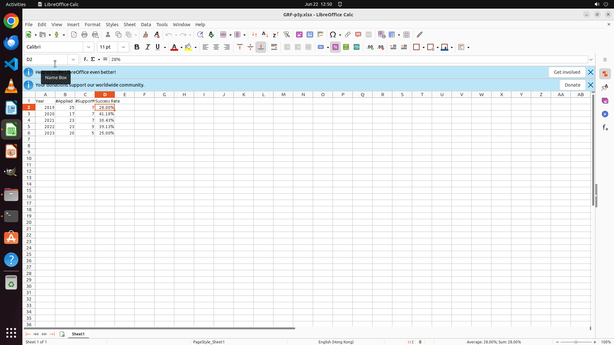

# I am an assistant professor of CS at HKU, I want to apply for the General Research Fund next year, I…

[← Multi-app Workflows](../README.md) · [← Showcase](../../README.md)

## Task

> I am an assistant professor of CS at HKU, I want to apply for the General Research Fund next year, I need to get some insights, so I need you to help me to organise the data. First please help me to organise the pass rate of the GRF applications of the CS departments of each school for 2019~2023 in percentage form with 2 decimal digits in a table, which I can use subsequently. Set the headers as "Year", "#Applied", "#Supported", and "Success Rate". The materials are saved under Documents/Fundings. And please save the result table as "GRF-p5y.xlsx" on my desktop.

## Final state

## Artifacts

- [Trajectory](traj.jsonl) — per-step actions, reasoning, and screenshots
- [Runtime log](runtime.log)
- [Task definition](task.json) — original OSWorld task config
- Step screenshots: `step_*.png` in this folder

Task ID: `7e287123-70ca-47b9-8521-47db09b69b14` · Domain: `multi_apps` · Source: `authors`
