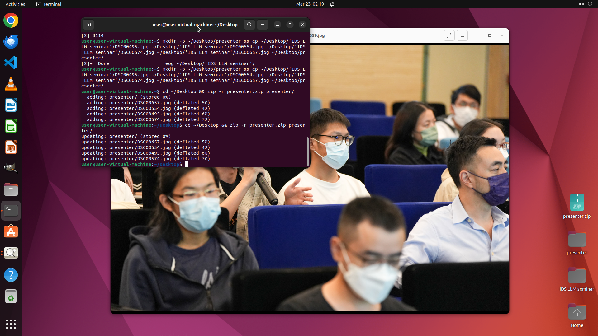

# Please sift through the folder with all the event photos taken by our photographer. I need you to ex…

[← Multi-app Workflows](../README.md) · [← Showcase](../../README.md)

## Task

> Please sift through the folder with all the event photos taken by our photographer. I need you to extract the photos featuring the presenters (a.k.a. Tao Yu) and place them in a separate folder named 'presenter'. Then, compress this folder into a zip file named 'presenter.zip' so I can easily share it with others later.

## Final state

## Artifacts

- [▶ Screen recording](recording.mp4) — full agent run
- [Trajectory](traj.jsonl) — per-step actions, reasoning, and screenshots
- [Runtime log](runtime.log)
- [Task definition](task.json) — original OSWorld task config
- Step screenshots: `step_*.png` in this folder

Task ID: `82e3c869-49f6-4305-a7ce-f3e64a0618e7` · Domain: `multi_apps` · Source: `authors`
