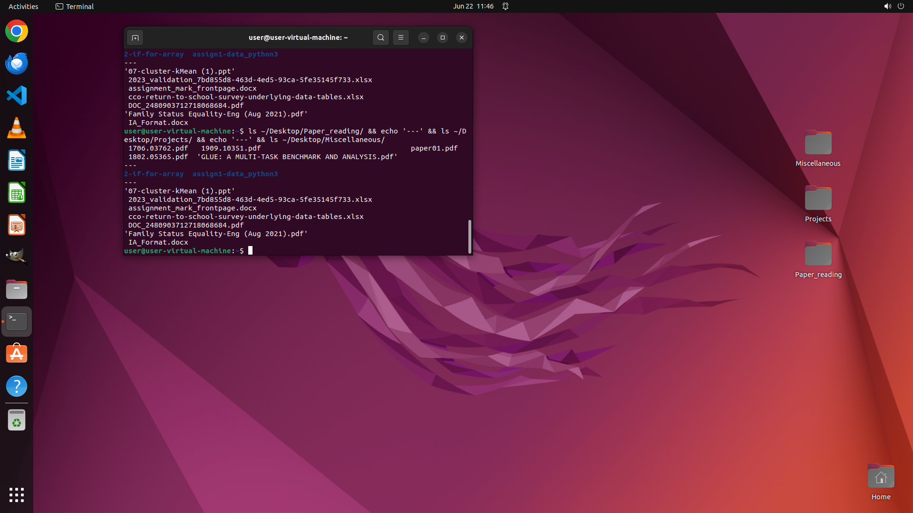

# Can you organize my desktop by identifying academic papers, coding projects, and other documents, en…

[← Multi-app Workflows](../README.md) · [← Showcase](../../README.md)

## Task

> Can you organize my desktop by identifying academic papers, coding projects, and other documents, ensuring no file is misplaced? Specifically, place academic papers in the 'Paper_reading' folder, coding projects in 'Projects', and categorize everything else under 'Miscellaneous'. For files lacking clear extensions or names, apply content analysis to determine their appropriate classification.

## Final state

## Artifacts

- [Trajectory](traj.jsonl) — per-step actions, reasoning, and screenshots
- [Runtime log](runtime.log)
- [Task definition](task.json) — original OSWorld task config
- Step screenshots: `step_*.png` in this folder

Task ID: `869de13e-bef9-4b91-ba51-f6708c40b096` · Domain: `multi_apps` · Source: `authors`
