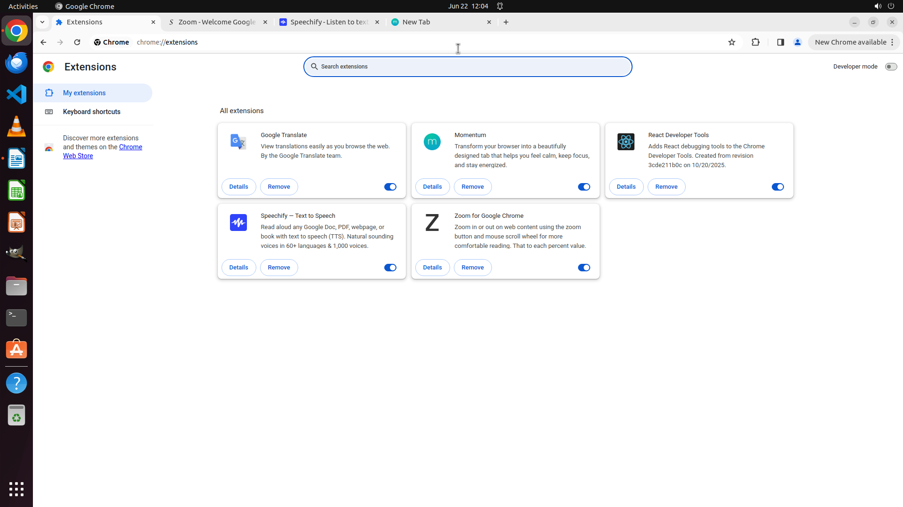

# My friend is a "plugin guru" and he recommended some good plug-ins to me. Please go to the Chrome pl…

[← Multi-app Workflows](../README.md) · [← Showcase](../../README.md)

## Task

> My friend is a "plugin guru" and he recommended some good plug-ins to me. Please go to the Chrome plug-in store and install all the listed plug-ins.

## Final state

## Artifacts

- [Trajectory](traj.jsonl) — per-step actions, reasoning, and screenshots
- [Runtime log](runtime.log)
- [Task definition](task.json) — original OSWorld task config
- Step screenshots: `step_*.png` in this folder

Task ID: `873cafdd-a581-47f6-8b33-b9696ddb7b05` · Domain: `multi_apps` · Source: `author`
