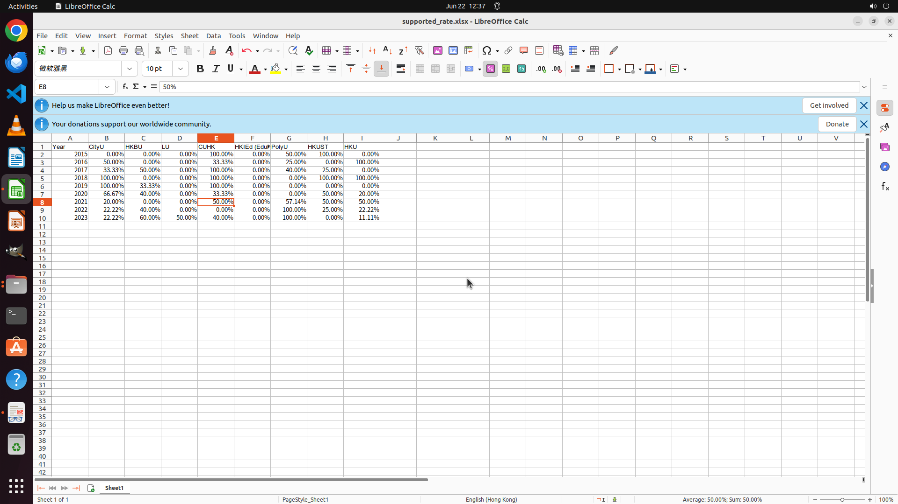

# I want to find a faculty job in Hong Kong, so I am more curious about the "Early Career Scheme" of t…

[← Multi-app Workflows](../README.md) · [← Showcase](../../README.md)

## Task

> I want to find a faculty job in Hong Kong, so I am more curious about the "Early Career Scheme" of those schools is better to apply, please help me to count all the documents in the ecs pdf files in my hand, and organize the pass rate of each school by year into table!

## Final state

## Artifacts

- [Trajectory](traj.jsonl) — per-step actions, reasoning, and screenshots
- [Runtime log](runtime.log)
- [Task definition](task.json) — original OSWorld task config
- Step screenshots: `step_*.png` in this folder

Task ID: `881deb30-9549-4583-a841-8270c65f2a17` · Domain: `multi_apps` · Source: `authors`
