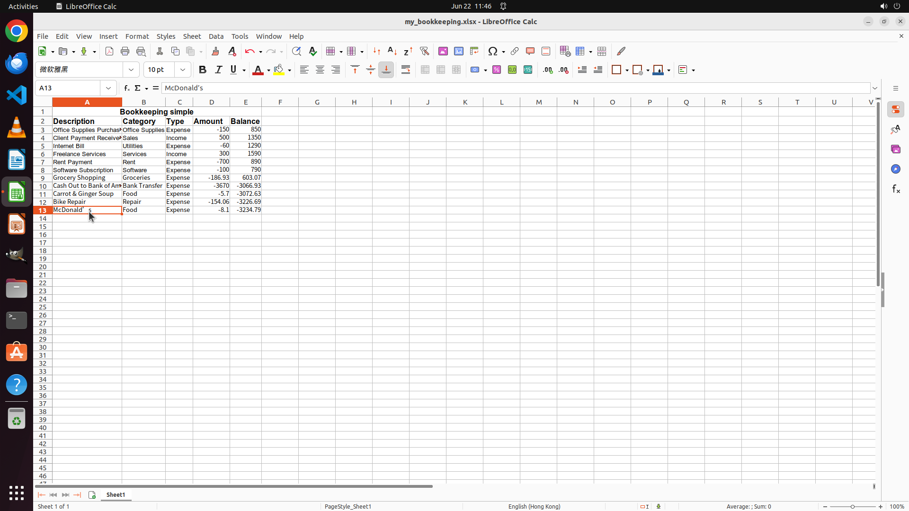

# Please update my bookkeeping sheet with the recent transactions from the provided folder, detailing …

[← Multi-app Workflows](../README.md) · [← Showcase](../../README.md)

## Task

> Please update my bookkeeping sheet with the recent transactions from the provided folder, detailing my expenses over the past few days.

## Final state

## Artifacts

- [Trajectory](traj.jsonl) — per-step actions, reasoning, and screenshots
- [Runtime log](runtime.log)
- [Task definition](task.json) — original OSWorld task config
- Step screenshots: `step_*.png` in this folder

Task ID: `8e116af7-7db7-4e35-a68b-b0939c066c78` · Domain: `multi_apps` · Source: `authors`
