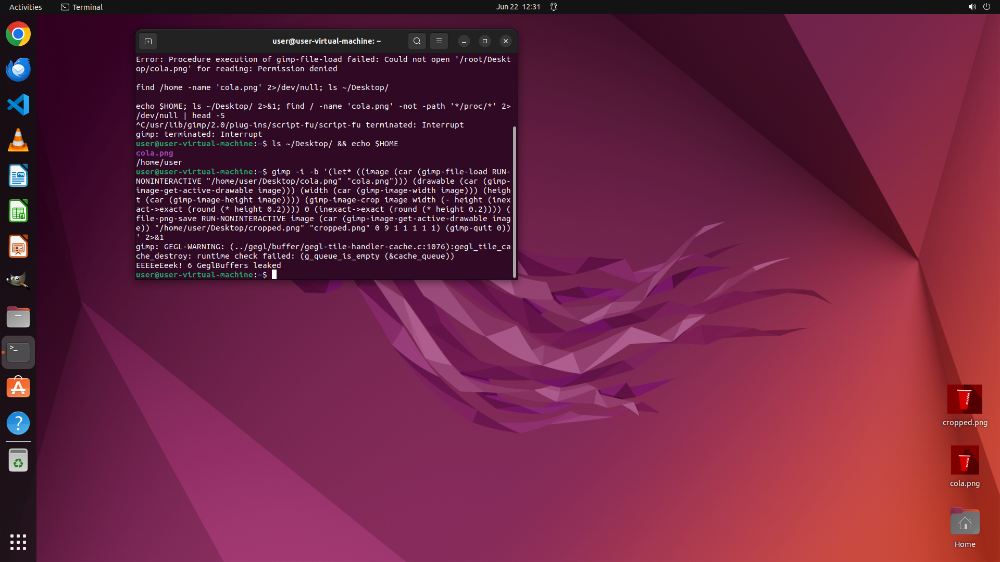

# Launch GIMP from the command line to edit "cola.png" and crop the top 20% off the image for my avata…

[← Multi-app Workflows](../README.md) · [← Showcase](../../README.md)

## Task

> Launch GIMP from the command line to edit "cola.png" and crop the top 20% off the image for my avatar as "cropped.png".

## Final state

## Artifacts

- [Trajectory](traj.jsonl) — per-step actions, reasoning, and screenshots
- [Runtime log](runtime.log)
- [Task definition](task.json) — original OSWorld task config
- Step screenshots: `step_*.png` in this folder

Task ID: `91190194-f406-4cd6-b3f9-c43fac942b22` · Domain: `multi_apps`
