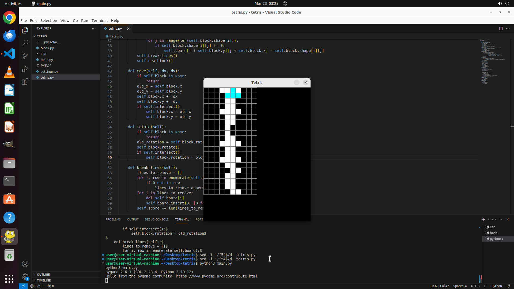

# Hi, I recently playing with developing a small python-based tetris game. While I have finished most …

[← Multi-app Workflows](../README.md) · [← Showcase](../../README.md)

## Task

> Hi, I recently playing with developing a small python-based tetris game. While I have finished most of the part, something is wrong under some cases when I press up to rotate, the whole program will crash, please run the code for me and fix the bugs of code.

## Final state

## Artifacts

- [▶ Screen recording](recording.mp4) — full agent run
- [Trajectory](traj.jsonl) — per-step actions, reasoning, and screenshots
- [Runtime log](runtime.log)
- [Task definition](task.json) — original OSWorld task config
- Step screenshots: `step_*.png` in this folder

Task ID: `9219480b-3aed-47fc-8bac-d2cffc5849f7` · Domain: `multi_apps` · Source: `authors`
