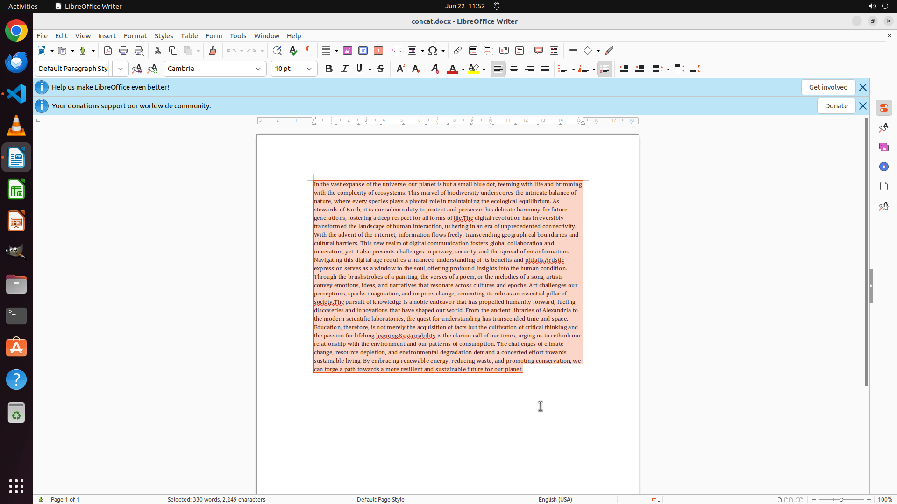

# Merge the contents of all .txt files from your vscode project into a single document "concat.docx" o…

[← Multi-app Workflows](../README.md) · [← Showcase](../../README.md)

## Task

> Merge the contents of all .txt files from your vscode project into a single document "concat.docx" on Desktop with libreoffice writer. No merging separator is needed. Ensure to set the overall font size of the document to 10.

## Final state

## Artifacts

- [Trajectory](traj.jsonl) — per-step actions, reasoning, and screenshots
- [Runtime log](runtime.log)
- [Task definition](task.json) — original OSWorld task config
- Step screenshots: `step_*.png` in this folder

Task ID: `98e8e339-5f91-4ed2-b2b2-12647cb134f4` · Domain: `multi_apps`
