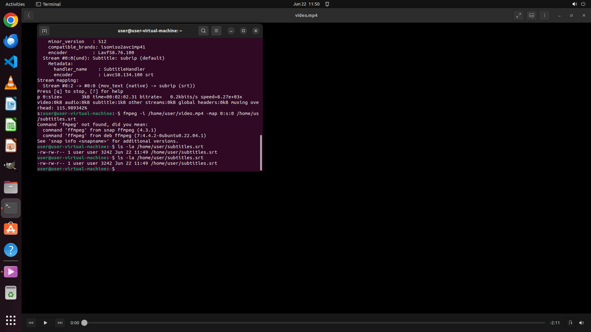

# I downloaded a video to practice listening, but I don't know how to remove the subtitles. Please hel…

[← Multi-app Workflows](../README.md) · [← Showcase](../../README.md)

## Task

> I downloaded a video to practice listening, but I don't know how to remove the subtitles. Please help me remove the subtitles from the video and export it as "subtitles.srt" and store it in the same directory as the video.

## Final state

## Artifacts

- [Trajectory](traj.jsonl) — per-step actions, reasoning, and screenshots
- [Runtime log](runtime.log)
- [Task definition](task.json) — original OSWorld task config
- Step screenshots: `step_*.png` in this folder

Task ID: `9f3bb592-209d-43bc-bb47-d77d9df56504` · Domain: `multi_apps` · Source: `authors`
