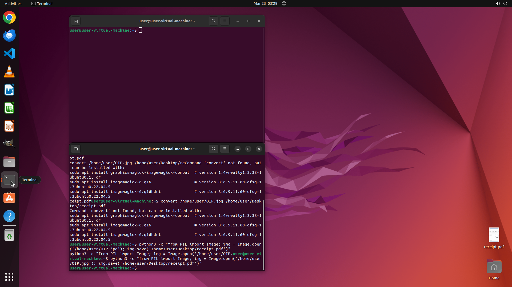

# I have an image of my receipt located in /home/user. I'm looking to transform it into a PDF file. Ca…

[← Multi-app Workflows](../README.md) · [← Showcase](../../README.md)

## Task

> I have an image of my receipt located in /home/user. I'm looking to transform it into a PDF file. Can you assist me with this task? Save the resulting PDF as "receipt.pdf" on the desktop.

## Final state

## Artifacts

- [▶ Screen recording](recording.mp4) — full agent run
- [Trajectory](traj.jsonl) — per-step actions, reasoning, and screenshots
- [Runtime log](runtime.log)
- [Task definition](task.json) — original OSWorld task config
- Step screenshots: `step_*.png` in this folder

Task ID: `a503b07f-9119-456b-b75d-f5146737d24f` · Domain: `multi_apps` · Source: `authors`
