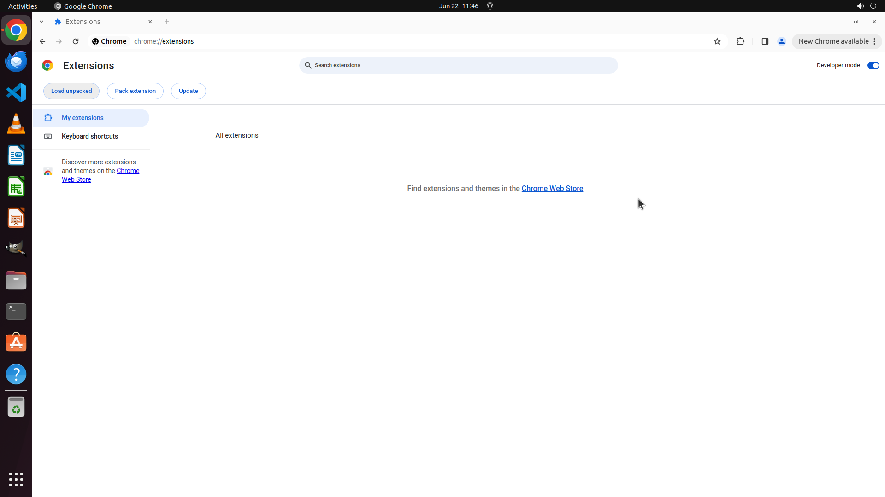

# I have developed a new Chrome extension myself, so it needs to be installed manually. Please help me…

[← Multi-app Workflows](../README.md) · [← Showcase](../../README.md)

## Task

> I have developed a new Chrome extension myself, so it needs to be installed manually. Please help me install the extension located in the Desktop directory into the Chrome browser.

## Final state

## Artifacts

- [Trajectory](traj.jsonl) — per-step actions, reasoning, and screenshots
- [Runtime log](runtime.log)
- [Task definition](task.json) — original OSWorld task config
- Step screenshots: `step_*.png` in this folder

Task ID: `a74b607e-6bb5-4ea8-8a7c-5d97c7bbcd2a` · Domain: `multi_apps` · Source: `https://support.google.com/chrome/thread/205881926/it-s-possible-to-load-unpacked-extension-automatically-in-chrome?hl=en`
