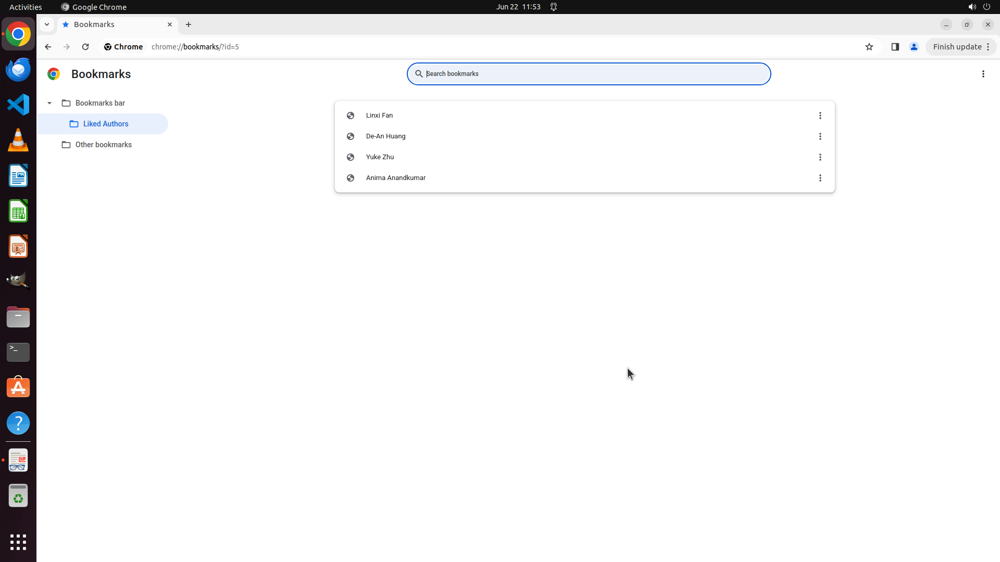

# I'm really enjoying this paper. Could you please locate the personal webpages of the initial author …

[← Multi-app Workflows](../README.md) · [← Showcase](../../README.md)

## Task

> I'm really enjoying this paper. Could you please locate the personal webpages of the initial author and the last three authors? Please include them in a browser bookmark folder titled 'Liked Authors' under the 'Bookmarks bar'.

## Final state

## Artifacts

- [Trajectory](traj.jsonl) — per-step actions, reasoning, and screenshots
- [Runtime log](runtime.log)
- [Task definition](task.json) — original OSWorld task config
- Step screenshots: `step_*.png` in this folder

Task ID: `a82b78bb-7fde-4cb3-94a4-035baf10bcf0` · Domain: `multi_apps` · Source: `authors`
