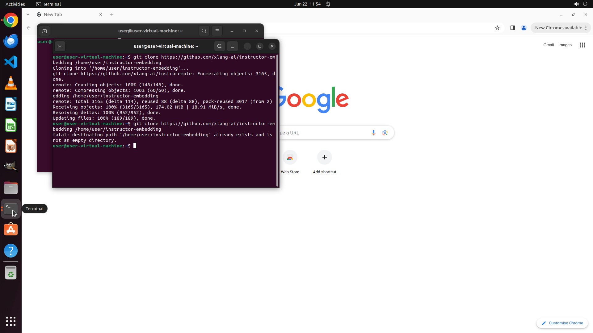

# Please help me clone the repo "https://github.com/xlang-ai/instructor-embedding" to /home/user.

[← Multi-app Workflows](../README.md) · [← Showcase](../../README.md)

## Task

> Please help me clone the repo "https://github.com/xlang-ai/instructor-embedding" to /home/user.

## Final state

## Artifacts

- [Trajectory](traj.jsonl) — per-step actions, reasoning, and screenshots
- [Runtime log](runtime.log)
- [Task definition](task.json) — original OSWorld task config
- Step screenshots: `step_*.png` in this folder

Task ID: `acb0f96b-e27c-44d8-b55f-7cb76609dfcd` · Domain: `multi_apps` · Source: `authors`
