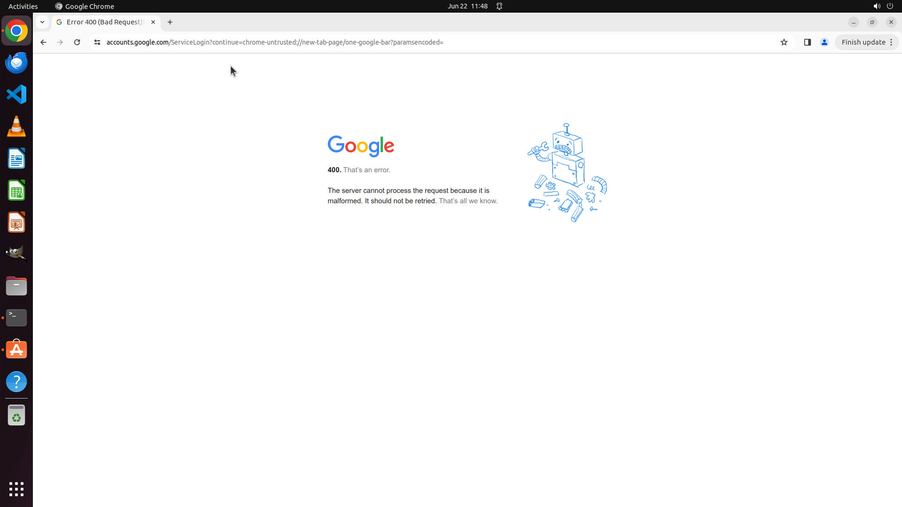

# Recently, I've been exploring the use of the Vim editor for code editing. However, the default setti…

[← Multi-app Workflows](../README.md) · [← Showcase](../../README.md)

## Task

> Recently, I've been exploring the use of the Vim editor for code editing. However, the default settings don't display line numbers in Vim editor. Please search the Internet for a tutorial on adding absolute line numbers in Vim and setting it as default for my local Vim.

## Final state

## Artifacts

- [Trajectory](traj.jsonl) — per-step actions, reasoning, and screenshots
- [Runtime log](runtime.log)
- [Task definition](task.json) — original OSWorld task config
- Step screenshots: `step_*.png` in this folder

Task ID: `b337d106-053f-4d37-8da0-7f9c4043a66b` · Domain: `multi_apps` · Source: `authors`
