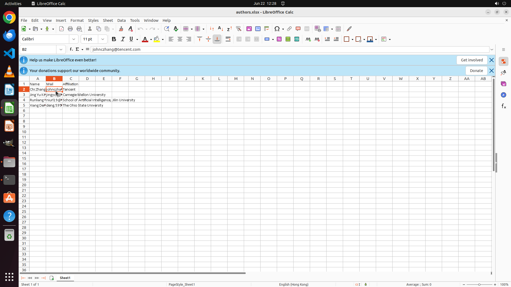

# Please help me to extract the name, e-mail, and affiliation of the first author from each paper in t…

[← Multi-app Workflows](../README.md) · [← Showcase](../../README.md)

## Task

> Please help me to extract the name, e-mail, and affiliation of the first author from each paper in the folder and organize them in an Excel table. Include headers for each field. Sort the authors by their full names alphabetically and save the table as "~/authors.xlsx".

## Final state

## Artifacts

- [Trajectory](traj.jsonl) — per-step actions, reasoning, and screenshots
- [Runtime log](runtime.log)
- [Task definition](task.json) — original OSWorld task config
- Step screenshots: `step_*.png` in this folder

Task ID: `b5062e3e-641c-4e3a-907b-ac864d2e7652` · Domain: `multi_apps` · Source: `authors`
