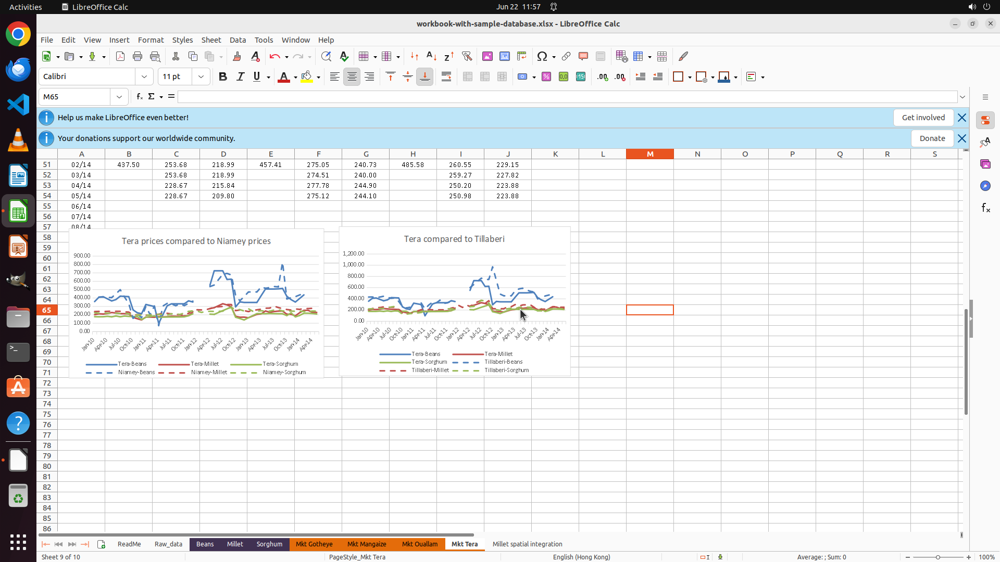

# The requirements of my data analysis assignment are listed in "reminder.docx" on the desktop. Help m…

[← Multi-app Workflows](../README.md) · [← Showcase](../../README.md)

## Task

> The requirements of my data analysis assignment are listed in "reminder.docx" on the desktop. Help me modify my assignment opended accordingly.

## Final state

## Artifacts

- [Trajectory](traj.jsonl) — per-step actions, reasoning, and screenshots
- [Runtime log](runtime.log)
- [Task definition](task.json) — original OSWorld task config
- Step screenshots: `step_*.png` in this folder

Task ID: `bc2b57f3-686d-4ec9-87ce-edf850b7e442` · Domain: `multi_apps` · Source: `authors`
