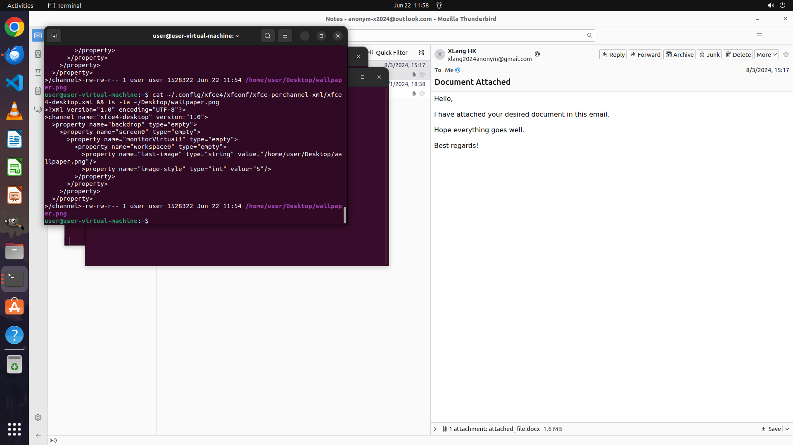

# Help me export the first image from the doc file attached in the most recent email in Notes folder, …

[← Multi-app Workflows](../README.md) · [← Showcase](../../README.md)

## Task

> Help me export the first image from the doc file attached in the most recent email in Notes folder, and set this image as the new desktop background.

## Final state

## Artifacts

- [Trajectory](traj.jsonl) — per-step actions, reasoning, and screenshots
- [Runtime log](runtime.log)
- [Task definition](task.json) — original OSWorld task config
- Step screenshots: `step_*.png` in this folder

Task ID: `c2751594-0cd5-4088-be1b-b5f2f9ec97c4` · Domain: `multi_apps` · Source: `authors`
